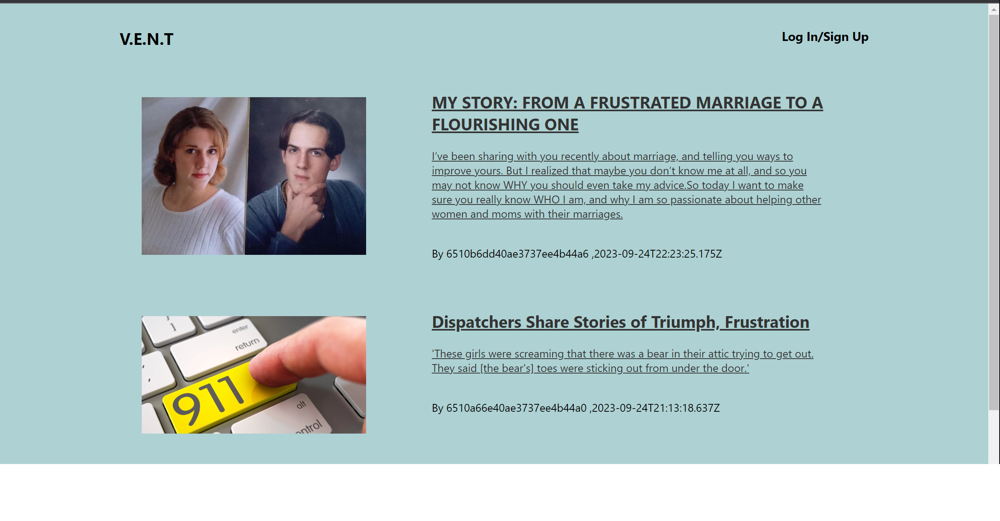
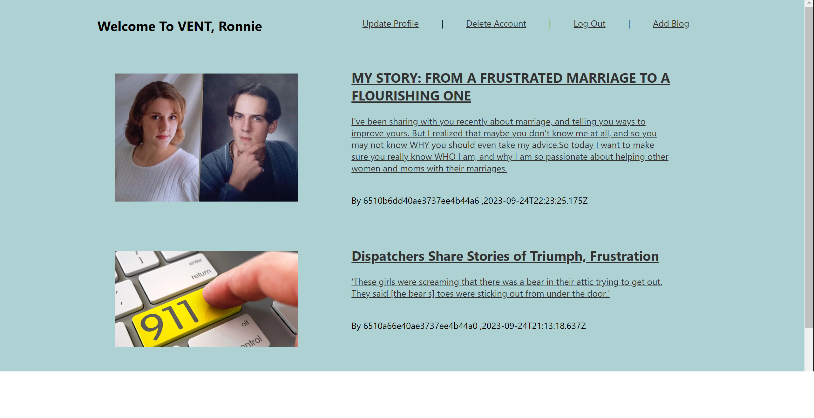
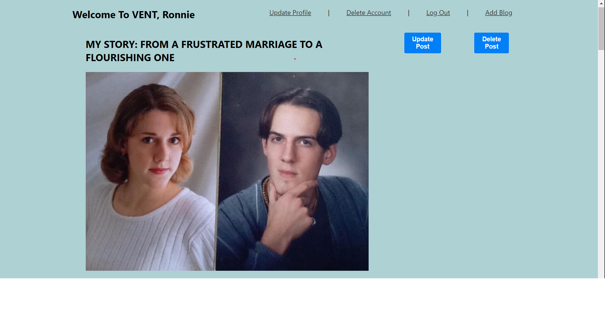
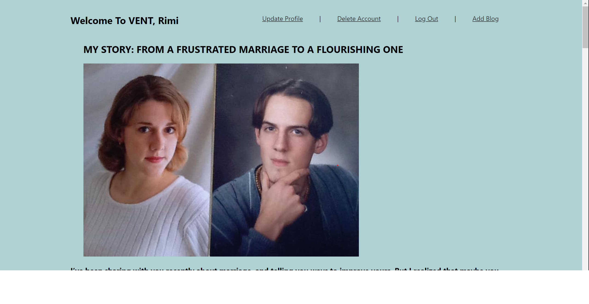

<h2>Introduction</h2>

This is a blog site called VENT with its main purpose to allow individuals to vent out their frustrations to the public while chosing to either be anonimouse or not. the blog site has full CRUD on the user and the blogs itself.

Wireframe

Landing page when not signed Up or loged in

Landing page when signed Up or Login

Author blog page

Non Author blog page

<h2>Technologies Used</h2>
<ul>
<li>React JS</li>
<li>Node JS</li>
<li>Express JS</li>
<li>Mongoose</li>
<li>Mongo DB</li>
<li>Json webtoken</li>
<li>Bcrypt</li>
<li>React Quil</li>
<li>Multer</li>
<li>React Router Dom</li>
<li>Dotenv</li>
</ul>

<h2>Getting Started</h2>
<a href="https://trello.com/b/dL5Qv5El/vent">Trello board</a> 
<a href="https://vent-yttt.onrender.com/">Deployed Site</a>

<h2>Future Enhancements</h2>

<ul>
<li>Add comments Section for every blog</li>
<li>implement full CRUD on evevy comment Section for every blog</li>
</ul>